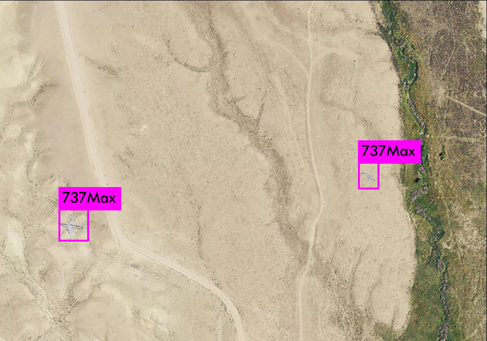

# 737MaxRescue
I am on a mission to rescue the 737 Max, I employ analysis on satellite imagery to spot them and guide them to safety
# Installation 
Clone the git project:
```
$ git clone https://github.com/axonml/BattleTankDown
```

## Build it 
Open the MakeFile and set the following if you have it in your system  
```
GPU=1
CUDNN=0
OPENCV=1
```
And now you are ready to make it 
```
make
```


## Results



